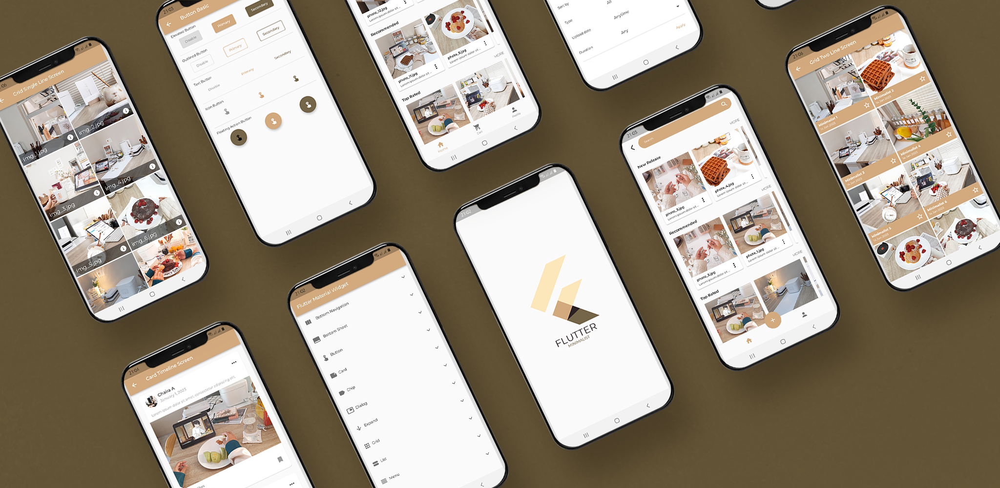

# Flutter Widget Minimalist

Flutter Widget Minimalist adalah aplikasi demo yang berisi kumpulan-kumpulan Flutter Material Widget
dengan tema Minimalist. Semua asset gambar yang digunakan dimiliki
oleh [Chaira A](https://www.youtube.com/@ChairaA).

    Flutter version: 3.3.8
    Dart Version: 2.18.4
    Font: Montserrat

## 💻 Requirements

- Any Operating System (MacOS, Linux, Windows)
- Any IDE with Flutter SDK installed (Android Studio, VSCode etc)
- A little knowledge of Dart and Flutter

## 🎬 Demo Apps

## 👀 Implementasi Widget

* Bottom Navigation Bar
* Bottom Sheet
* Button
* Card
* Chip
* Dialog
* Expand
* Grid
* List
* Menu
* Picker
* Progress
* Seekbar
* Snackbar
* Tab
* Toolbar

## 📸 ScreenShots

## 🤠 Author(s)

**Roma Akbar Iswara**

## 🎁 Thanks For(s)

[Chaira A](https://www.youtube.com/@ChairaA)